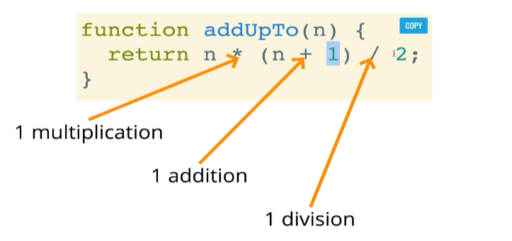
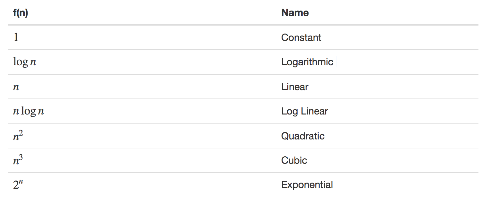
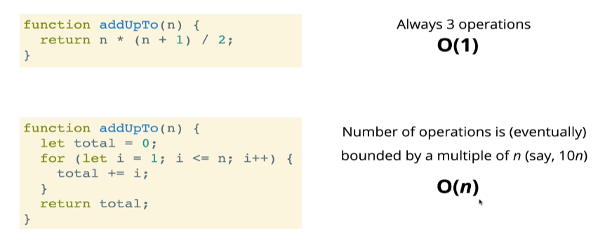
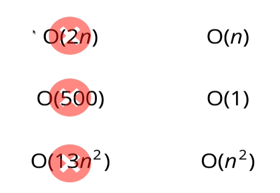

---

layout: post

title: Big O - 시간복잡도

subtitle: Udemy class

categories: algorithm

tags: [javascript, algorithm]

---
# Big O 표기법

- Big O 표기법의 필요성
- Big O란?
- Big O 표기법의 표현
- 시간 복잡성과 공간 복잡성
- Big O 표기법을 사용한 알고리즘 평가
- log 란?

## Big O 표기법의 필요성

알고리즘을 풀면서 혹은 페이지를 구현하며 만나는 수많은 문제들은 각각 무수한 해결법이 존재한다. 문제를 해결하면서도 어떤 방법이 최선일까 라는 의문을 가진적이 있을 것이다. 

각각의 해결법은 사소한 풀이방식 부터 접근 방식 까지 크고 다른 차이점을 가지고 있지만 결국 어떠한 해결법이 최선인지를 알아내면 최고의 결과를 뽑아낼 수 있을 것이다.

이것이 Big O의 핵심이다. 여러코드들 즉, 해결 방법들을 일반적으로 비교하고 성능을 평가하는 시스템이다. 

### 그냥 돌아가면 그만 아닌가?

- 물론 가끔은 시간적, 공간적 성능을 떠나 제대로 작동하는 코드가 최선일 때는 있지만 테스트, 인터뷰 그리고 크기가 큰 데이터셋 을 다루면 그 성능 차이는 어마어마하게 벌어질 것이다.
    
    그렇기에 코드의 성능을 이야기 할땐 추상적이거나 애매한 용어가 아닌 전문적인 용어를 사용하는 것이 중요하다. 항상 수치나 용어의 정확한 정의는 결과를 보다 최선으로 만들기 때문이고, 코드의 성능이 어떤지 이해하는 것에 도움이 된다.
    

- 각각 다른 접근법에서 최선의 방법을 찾아내는 것은 그렇게 뻔하지 않다. 반대로 최선과 최악의 해결책인 경우도 뻔하지 않다. 항상 상황에 따라 효율이 바뀔 수 있다는 것을 알아야한다.
- 코드를 디버그할 때 코드를 느리게 만드는 것은 이해하는데 매우 중요하다. 단순히 에러를 찾는 것 뿐만 아니라 실행함에 있어 계획보다 더 오랜 시간이 걸릴 수 있고, 브라우저에서 실행 했을 때 렉이 걸린다면 정말 최악일 것이다.
- 면접, 테스트 때 자주나온다.

이러한 이유들로 Big O에 대해 이해한다면 어디서 문제가 나타나는지 보다 찾기 쉬울 수 있을 것이다.

## 코드 시간 재기

간단하게 0 ~ n 까지 더하는 함수를 구현해보자

```jsx
function addUpTo(n) {
    let sum = 0;
    for(let i = 1; i <= n; i++) {
        sum += i;
    }
    return sum;
}

console.log(addUpTo(6));
```

가장 쉽게 생각할 수 있는 방식이다.

```jsx
function addUpTo(n) {
    return n * (n + 1) / 2;
}

console.log(addUpTo(6));
```

루프를 돌리지 않고 수학 공식만을 이용해 같은 결과를 나타낼 수 있다.
이처럼 아예 접근 방식 자체가 다른 방법이 무수하다.

## 더나은 코드?

그러면 더 나은 코드라는 것이 대체 어떤 코드일까?

- 빠른 코드
- 메모리 사용량
- 가독성
- 코드량

대부분의 사람들은 코드의 실행 속도를 중요하게 생각하고 실제로 그러한 경우가 많다. 물론 모든 사항을 반영한 코드가 가장 좋겠지만 우선적으로 속도를 평가하는 것부터 집중해보자.

속도를 평가하기 위해 `performance.now()` 메서드를 사용할 것이다.
이 메서드를 사용하면 브라우저가 해당 문서를 만든 시간 즉, 해당 창이 열린 시간을 알려주기 때문에 메서드 사이에 함수를 호출하면 문서가 열려있던 시간을 알 수 있다. 

```jsx
function addUpTo(n) {
    let sum = 0;
    for(let i = 0; i < n; i++) {
        sum += i;
    }
    return sum;
}

let t1 = performance.now();
addUpTo(1000000000);
let t2 = performance.now();

console.log(`Time Elapsed: ${(t2 - t1) / 1000} seconds.`);

// Time Elapsed: 0.9082000000476838 seconds.
```

t1과 t2 사이에 메서드를 실행해 t2에 시간을 계속 더해 두 수의 차이로 속도를 계산하였다.
기본적인 접근의 코드는 약 0.9초가 걸렸다.

```jsx
function addUpTo(n) {
    return n * (n + 1) / 2;
}

let t1 = performance.now();
addUpTo(1000000000);
let t2 = performance.now();

console.log(`Time Elapsed: ${(t2 - t1) / 1000} seconds.`);

// Time Elapsed: 0.00009999990463256836 seconds.
```

비교 대상으로 작성한 코드는 0.00009 초 정도 걸렸는데 눈으로 봐도 속도의 차이가 크게 나고있다.

하지만 이러한 방식을 완전히 믿을 수 없다. 기기마다 다른 방식으로 시간을 기록할 것이고. 수동적으로 메서드 사이에서 함수를 실행시킨 것이 정확하게 성능을 측정했다고 보기 힘들 것이다. 

두 코드의 속도차이가 뒤바뀔 상황은 없겠지만 완전히 이 방식을 믿을 수는 없다. 기기로 직접 차이를 비교하는 것은 좋지만 확신할 수 없는 테스트를 실행하지 않고 코드의 성능을 비교할 수 있는 Big O 방식을 사용해보자.

## 연산 갯수 세기

코드시간을 재는 파트에서 실제 코드를 테스트하는 것으로 성능을 측정했다면 이번엔 컴퓨터가 처리해야하는 연산의 갯수를 세어 성능을 측정해보자. 어떤 기기던 연산의 갯수는 바뀌지 않을 것이기 때문에 연산갯수에 따라 코드의 성능을 따질 수 있을 것이다.



실행시간이 보다 빨랐던 코드를 살펴보면 총 3개의 연산 과정으로 이뤄져 있다. 파라미터인 n이 어떤한 수로 할당되어도 실제 연산과정은 3번으로 변하지 않는다.


이번엔 반복문을 사용했던 코드를 살펴보자. 크게 보면 3번의 연산이 이뤄지지만 반복문 안에 있기 때문에 각 연산이 n 번 일어날 것이다. 

하지만 정확히 일어나는 연산의 횟수에 집중하지 않고 전체적인 추세를 보는것이 이 방법의 핵심이다. 예를 들어 위 반복문 코드는 5n + 2 만큼 일어날 것이다. 이러한 숫자보다 더 큰 틀을 본다면 n이 커질수록 연산의 갯수도 비례적으로 늘어난다는 것을 볼 수 있다.

## Big O 공식

Big O 는 대략적으로 숫자를 세는 것에 붙인 공식적인 표현이며 정식으로 입력된 내용이 늘어날 수록 알고리즘의 실행 시간이 어떻게 변하는지 설명하는 공식적인 방식이다. 즉, 입력의 크기와 실행시간의 관계를 의미한다.

Big O 는 일반적으로 가장 높은 실행 시간 값들을 말하는 것이다.



위 처럼 n의 입력에 따른 연산과정의 변화에 따라 큰 틀을 구분할 수 있다.

이러한 표기법을 따라 기존 코드들을 표현해보면 다음과 같다.



첫 번째 함수는 어떠한 값이 들어와도 연산 과정이 변하지 않기 때문에 상수값으로 고정되어 항상 일정한 실행시간을 유지한다.

두 번째 함수는 n이 증가함에 따라 반복문 내의 연산이 증가하므로 n을 표기하였는데 10n, 50n ... 처럼 디테일한 숫자가 아닌 n이라는 자릿수를 신경 써야한다. 앞에 어떠한 숫자가 들어와도 비례적으로 증가하는 것은 같기 때문에 궁극적으로 그래프를 그렸을 때 별 차이가 없기 때문이다.

```jsx
function countUpAndDown(n) {
    console.log('going up!');
    for(let i = 0; i < n; i++) {
        console.log(i);
    }
    console.log('At the top!\nGoing Down...');
    for(let j = n - 1; j >= 0; j--) {
        console.log(j);
    }
    console.log('Back down. Bye!');
}

countUpAndDown(10);
```

이번엔 다른 예시를 살펴보자.


위에서 보았던 반복문과 같은 맥락의 반복문으로 함수 내에서 같은 작업을 두번 하는 것을 볼 수 있다. O(n)이 두번 나오기 때문에 2n으로 생각할 수 있지만 실제  n이 증가할 수록 기존과 같이 비례하게 시간이 증가하기 때문에 이 또한 O(n)으로 표현한다.

값이 어떻게 들어오고 같은 작업이 얼마나 실행됐냐가 아닌 큰 그림으로 증가하는 추세를 확인해야한다.

```jsx
function printAllPairs(n) {
    for(let i = 0; i < n; i++) {
        for(let j = 0; j < n; j++) {
            console.log(i, j);
        }
    }
}
```

이번엔 이중 중첩 반복의 시간계산도를 알아보자.

이중 중첩의경우 n이 들어왔을 때 각 n마다 내부에서 반복이 n 만큼 실행되어 연산이 진행된다. 따라서 2n이 아닌 n * n 즉, n 제곱의 복잡도를 가진다.


위 처럼 제곱의 복잡도를 가진 코드는 n의 증가에 따라 기하 급수적으로 연산이 늘어날 것이다.

## 표현식 단순화 하기

지금까지 알아본 Big O의 이론을 보면 각 코드의 연산을 세는 것은 번거롭고 크게 중요하지 않기 때문에 전체적인 추세를 중요하게 여긴다는 것을 알 수 있다.

그렇기 때문에 5n + 2 같은 자세한 연산에 대해 신경쓰지 않고 n의 증가에 따라 연산의 증가에 초점을 맞춰 증가하는 추세인 n으로 단순화 하였다. 



간단하게 생각해 앞에 붙는 상수는 필요가 없기에 제거하면 되는데 아직 이해가 안간다면 1000n 이던 10n 이던 그래프는 전부 비슷해 보인다는 것을 생각해보자. 결국 Big O는 n의 증가에 따라 내부 연산이 어떻게 증가하는가를 이야기 하는 것이기 때문이다.

### 쉽게 적용할 규칙

- 산수는 상수이다. → 사실상 2+2와 100만 + 2의 연산 속도는 비슷하다. 상수에 상수를 더하는 것이기 때문이다.
- 변수 선언은 상수이다. → 변수에 어떤 값이 들어오던 값을 배정하는 시간은 비슷하다.
- 배열에 인덱스를 사용해 접근하는 것은 상수이다. → 인덱스의 주소를 찾아가는 시간은 비슷하다.
- 객체의 key를 기준으로 접근하는 것은 상수이다.
- 루프가 있으면 복잡도가 루프의 길이 곱하기 루프안의 연산들이다. → 배열을 루프로 연산한다면 그 길이만큼 증가한다. 단, 루프 안에서 일어나는 작업에 따라 달라질 수 있다.

```jsx
function logAtLeast(n) {
    for(let i = 1; i <= Math.max(5, n); i++) {
        console.log(i);
    }
}
```

이번엔 n이 최소로 들어와도 고정적으로 최소 5번을 반복하는 실행문을 만들었다. 

이러한 경우 최소 5번을 반복하는 것이 신경쓰이겠지만 결과적으로  n이 증가할수록 5라는 수는 매우 작은 수가 될 것이고, n이 더 증가할수록 기존 O(n)과 똑같은 추세를 그릴 것이다.

```jsx
function logAtMost(n) {
    for(let i = 1; i <= Math.min(5, n); i++) {
        console.log(i);
    }
}
```

반대로 5보다 작을 때는 n 만큼 반복하지만 초과할 경우 최대 5번만 반복하는 함수이다. 이런 경우는 어떨까?

어렵게 생각할 필요없이 값이 증가할 경우만 따져보면 아무리 값이 늘어나도 최대 5이기 때문에 상수로 볼 수 있다.


위 처럼 그래프의 기울기만 보아도 어떠한 시간복잡도를 가진 코드가 보다 효율적인지 판단할 수 있다.

물론 상수복잡도를 가진 코드라면 좋겠지만 고급 알고리즘이나 수많은 조건을 가진 코드의 경우도 많기에 사실상 O(n) 복잡도가 결코 나쁘지 않다는 것을 알아야한다.


---


## 마무리

알고리즘 문제를 풀 때 마다 갸우뚱 하면서도 어떤 코드가 좋고 나쁜지에 대한 기준이 없었기에 그냥 넘어갔지만 기초적인 부분이라도 조금씩 알고나니 속이 뚫리는 느낌이든다. 

대학생 때 아무것도 모르고 컴공의 알고리즘 수업을 들을 땐 이해가 안가는 부분이 많았지만 지금은 관심도나 이해도가 조금이라도 나아졌는지 꽤나 수월하게 하나하나 이해할 수 있었고 재밌는 파트였다.

아직 내 언어나 생각으로 글을 적는 단계까지 이해했다고 말할 수는 없지만 계속 문제를 해결하며 곱씹고 언젠가 깨닫는 날까지 꾸준히 노력해야한다.

<br><br><br>

## 참고 사이트
- [javascript 알고리즘 & 자료구조 마스터 클래스 (Udemy)](https://www.udemy.com/course/best-javascript-data-structures/learn/lecture/28559451#reviews)
